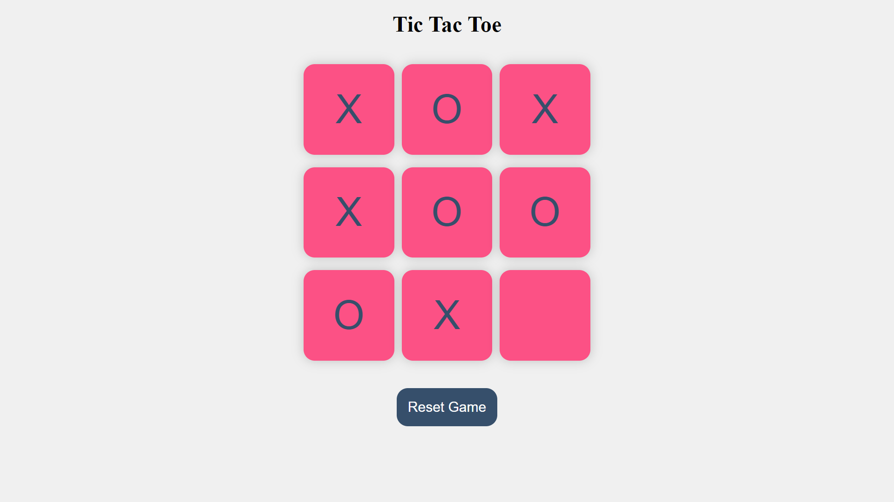

# 🎮 Tic-Tac-Toe Game

This is a simple Tic-Tac-Toe game built using HTML, CSS, and JavaScript. The game allows two players to play Tic-Tac-Toe in their browser, with options to reset and start a new game.



## ✨ Features

- 🕹️ Interactive Tic-Tac-Toe game board
- 📱 Responsive design for various screen sizes
- 🏆 Displays the winner or a draw message
- 🔄 Reset and New Game functionality

## 🚀 How to Play

1. Clone the repository:
   ```bash
   git clone https://github.com/ajinkyabh2203/tic-tac-toe.git
   ```
2. Navigate to the project directory:
   ```bash
   cd tic-tac-toe
   ```
3. Open index.html in your browser.

## 🧠 Game Logic

 - Players take turns to mark a square on the 3x3 grid.
 - The first player to get three of their marks in a row (horizontal, vertical, or diagonal) wins.
 - If all squares are filled and no player has three marks in a row, the game ends in a draw.

🎉 Enjoy the game!
